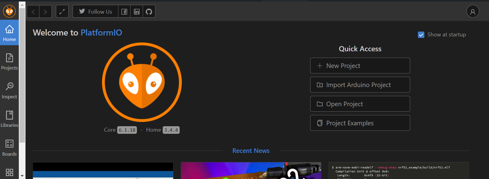

<p align="center">
  
  
  
  
  <br>
  
  
  
</p>

# Digital Bug


Digital Bug is a versatile Wi-Fi security and network analysis tool built for the ESP8266 microcontroller. It is designed for both interactive, controlled testing and covert, long-term reconnaissance, making it a valuable asset for penetration testers and cybersecurity professionals.

---

## ⚠️ Disclaimer

This tool is intended strictly for educational purposes and for authorized security testing on networks that you own or have explicit, written permission to assess. Unauthorized use of this tool on any network is illegal and unethical. The developers and contributors assume no liability and are not responsible for any misuse or damage caused by this program.

---

## Features
    
Digital Bug operates in two distinct modes, providing flexibility for various security assessment scenarios.

* Interactive Mode: The device hosts its own Wi-Fi access point, serving a comprehensive web interface to a connected device. This control panel allows for real-time network analysis and attack execution.

  * Access Point Scanner: Discovers and lists all nearby 802.11 networks, detailing their SSID, BSSID, signal strength (RSSI), channel, and encryption type.

  * Client Scanner: Identifies and lists all client devices connected to a specific target access point.

  * Probe Request Sniffer: Captures and displays probe requests to reveal the SSIDs that nearby devices are actively searching for.

  * Deauthentication Attack: Launches a targeted denial-of-service attack against selected clients to test network resilience and client reconnection behavior.

  * Dynamic Configuration: Allows for on-the-fly changes to the tool's own access point SSID and password via the web interface.

* Autonomous Mode: Designed for covert deployment, this mode operates silently without broadcasting its own network. It passively logs all discovered network traffic to internal files for later retrieval and analysis.

  * Silent AP Logging: Scans for and logs all unique access points to a networks.log file.

  * Silent Probe Logging: Captures and logs all unique probe requests to a probes.log file.

  * Stealth Operation: Provides no active feedback other than a discreet "heartbeat" LED blink, ensuring a minimal physical footprint.

## Project structure
```js
Digital-Bug/
├── .gitignore
├── LICENSE
├── README.md
├── platformio.ini      # PlatformIO project configuration
│
├── data/               # Files for the web interface
│   └── index.html
│
├── src/                # Source code
│   └── main.cpp
│
└── docs/               # Documentation and images
    └── image.png
```

## Getting Started

### Prerequisites

* **An ESP8266-based board** (e.g., NodeMCU, Wemos D1 Mini)  
  [Buy NodeMCU (ESP8266) on Amazon](https://www.amazon.in/dp/B0829Z1W6Y)
* Visual Studio Code with the PlatformIO IDE extension installed:


* A micro-USB cable that supports data transfer.

### Installation

1.  Clone the repository: 
```git
git clone https://github.com/kn9annihilator/Digital-Bug/
```
2. Open the cloned Digital-Bug folder in Visual Studio Code with PlatformIO.

3. PlatformIO will automatically detect the platformio.ini file and install the necessary libraries and dependencies (e.g., ArduinoJson).

3. Upload the filesystem image to the board. In PlatformIO, navigate to Project Tasks > nodemcuv2 > Platform > Upload Filesystem Image.

4. Upload the main program to the board by clicking the Upload button (▶️ icon) in the PlatformIO toolbar.


##  Usage

### Interactive Mode
1. Power on the ESP8266 board via USB. The device will boot into interactive mode by default.

2. Using a phone or laptop, connect to the Wi-Fi network named "Digital Bug" (or your custom SSID). The default password is 
```js
deauther
```

3. Open a web browser and navigate to 
```js
http://192.168.4.1 
```

4. Use the web interface to perform scans, launch attacks, or change settings.

### Autonomous Mode
1. Ensure the device is unplugged.

2. Press and hold down the "Flash" button on the NodeMCU board.

3. While still holding the button, connect the device to a USB power source (e.g., a power bank, wall adapter).

4. Once the device is powered on, you may release the button. The device is now silently logging all network data.

5. To retrieve the logs, power the device on in Interactive Mode and navigate to 
```js 
http://192.168.4.1/logs
```


##  Contributing

Contributions are what make the open-source community such an amazing place to learn, inspire, and create. Any contributions you make are **greatly appreciated**.

If you have a suggestion that would make this better, please fork the repo and create a pull request. You can also simply open an issue with the tag "enhancement".

1.  Fork the Project
2.  Create your Feature Branch 
```git
git checkout -b feature/AmazingFeature
```
3.  Commit your Changes 
```git
git commit -m 'Add some AmazingFeature
```
4.  Push to the Branch 
```git
git push origin feature/AmazingFeature
```
5.  Open a Pull Request


##  Connect with Me
[](https://www.linkedin.com/in/krishnanarula/)

